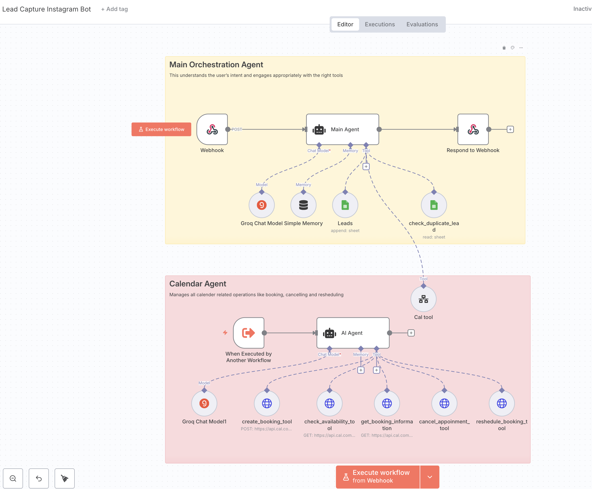
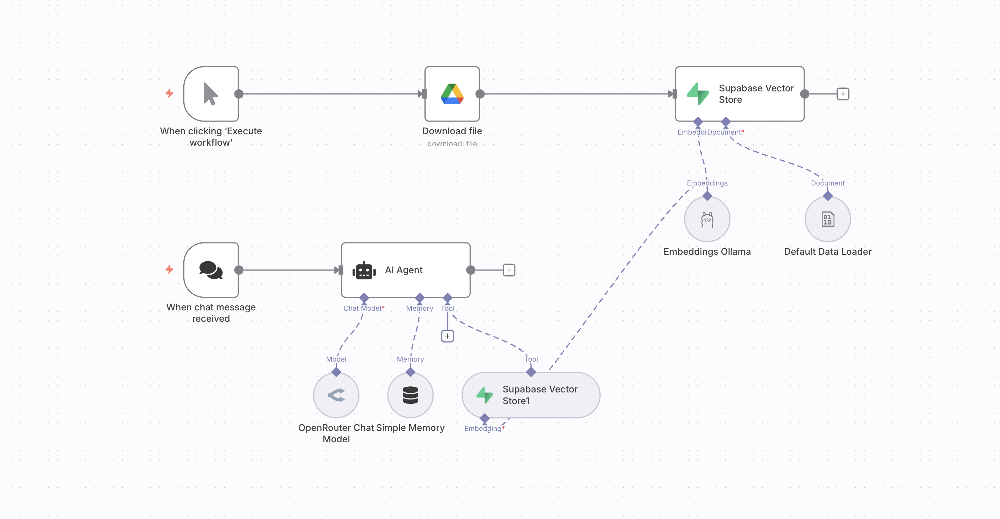

# n8n Automations

This repository contains a collection of n8n workflow automations for various business processes.

## Automations

### HR Hiring Automation
A workflow that automates the HR hiring process by processing incoming resumes from Gmail, storing them in Google Drive, and analyzing candidate information.

### Lead Capture Instagram Bot
An automation that captures leads from Instagram and processes them for marketing or sales follow-up.

### RAG (Retrieval-Augmented Generation)
A knowledge management workflow that implements Retrieval-Augmented Generation for improved information retrieval and content generation.

